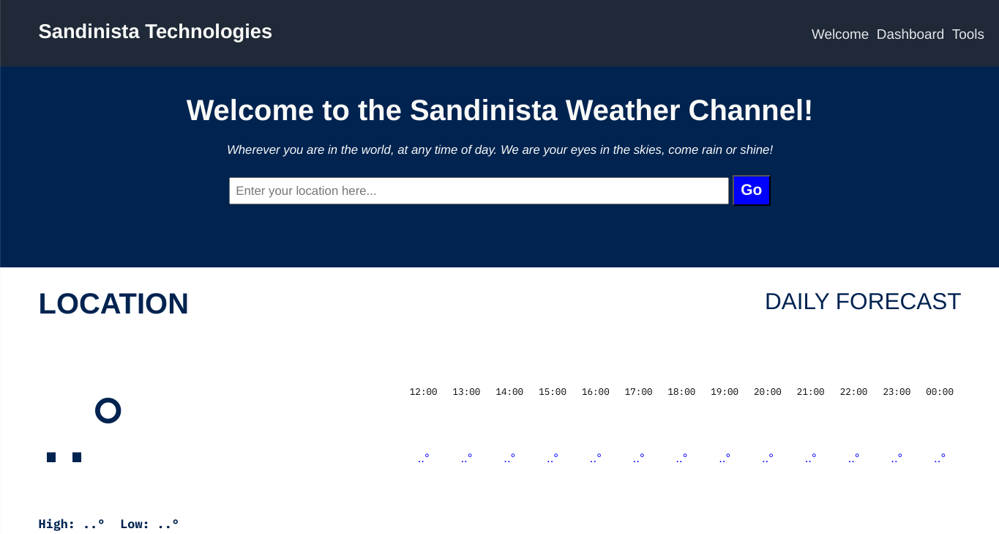

## WEATHER APP

## ABOUT

> *A simple weather application that allows users to input their desired location, then have access to a plethora of weather information of for that place*

- Retrieves data from a backend API
- Utilises async and await methods
- Dynamically displays a variety of data points pertaining to location 

## THIS PROJECT WAS MADE WITH

-    
-    
- 
- 

## USEFUL RESOURCES

- Stack Overflow
- Geeks for Geeks
- W3C Schools
- Mozilla Developer Network
- Javascript Documentation

## LINKS

[Try the assignment on The Odin Project](https://www.theodinproject.com/lessons/node-path-javascript-weather-app)

[Look to the Sky!](https://gangoffour199.github.io/weatherApp/)

This markdown file was created using [dilinger.io](https://dillinger.io/)
